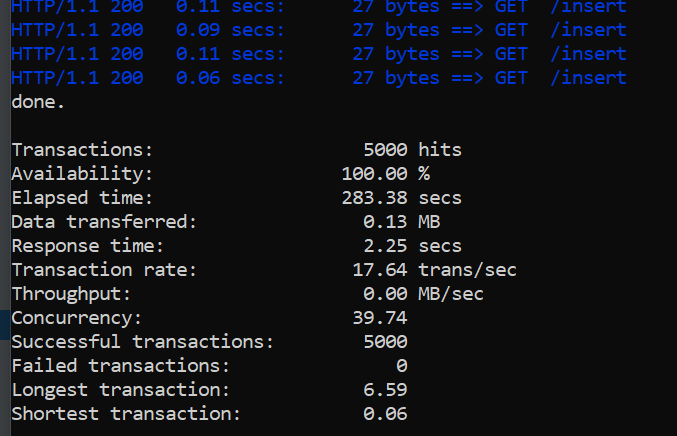
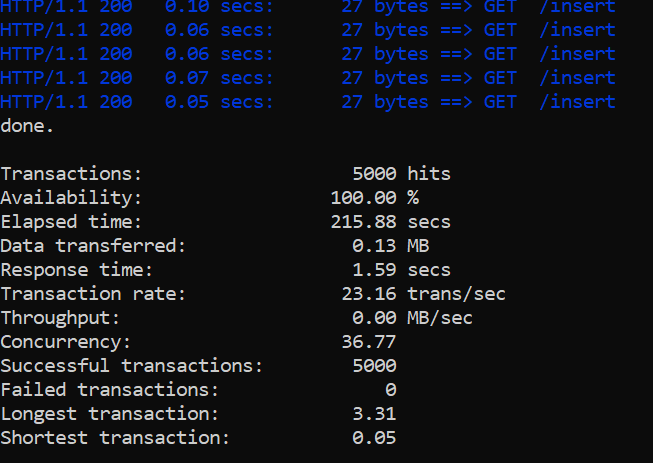
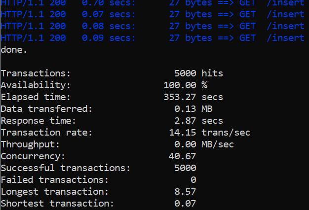
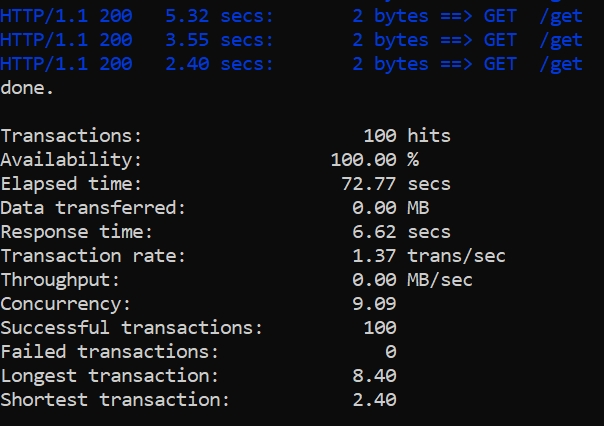
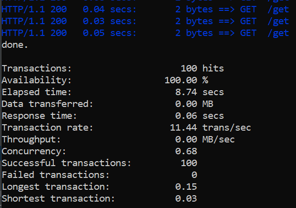
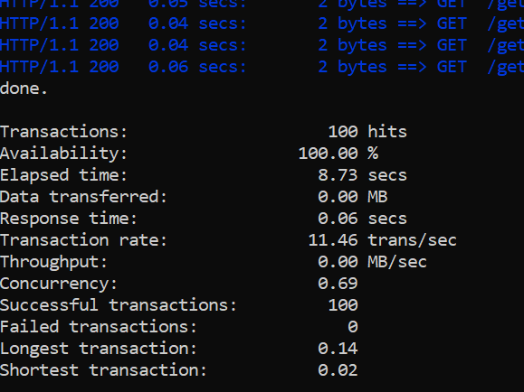

## **HW9**

### **Repository**

This repo contains 3 files:
* docker_compose.yml
* fill_1M_users.py
* siege_concurrent_test.py

**docker-compose.yml** - creates a container with mysql

**fill_1M_users.py** - this file is for filling test_users table. We can setup there amount of users 
which needs to be added and amount of threads to do this. By default: 1M users and 100 threads.

**siege_concurrent_test.py** - script for testing insert and select options in siege:
For example, http://localhost:8000/insert and http://localhost:8000/get.

### **Test mysql's innodb_flush_log_at_trx_commit using siege:**
#### Test 1:
* command for siege: C:\siege-windows\siege.exe -c 50 -r 100 http://localhost:8000/insert
* python script: siege_concurrent_test.py
* command for mysql: set global innodb_flush_log_at_trx_commit = 1;

Result:

#### Test 2:

* command for siege: C:\siege-windows\siege.exe -c 50 -r 100 http://localhost:8000/insert
* python script: siege_concurrent_test.py
* command for mysql: set global innodb_flush_log_at_trx_commit = 2;

Result:

#### Test 3:

* command for siege: C:\siege-windows\siege.exe -c 50 -r 100 http://localhost:8000/insert
* python script: siege_concurrent_test.py
* command for mysql: set global innodb_flush_log_at_trx_commit = 0;

### **Test indexes in mysql using siege:**
#### Test 1:
* command for siege: C:\siege-windows\siege.exe -c 10 -r 10 http://localhost:8000/get
* python script: siege_concurrent_test.py
* no indexes for date_of_birth column

Result:

#### Test 2:
* command for siege: C:\siege-windows\siege.exe -c 10 -r 10 http://localhost:8000/get
* python script: siege_concurrent_test.py
* BTREE index for date_of_birth column: CREATE INDEX date_of_birth_index ON test_users(date_of_birth);

Result:

#### Test 3:
* command for siege: C:\siege-windows\siege.exe -c 10 -r 10 http://localhost:8000/get
* python script: siege_concurrent_test.py
* HASH index for date_of_birth column: CREATE INDEX date_of_birth_index ON test_users(date_of_birth) USING HASH;

Result:

